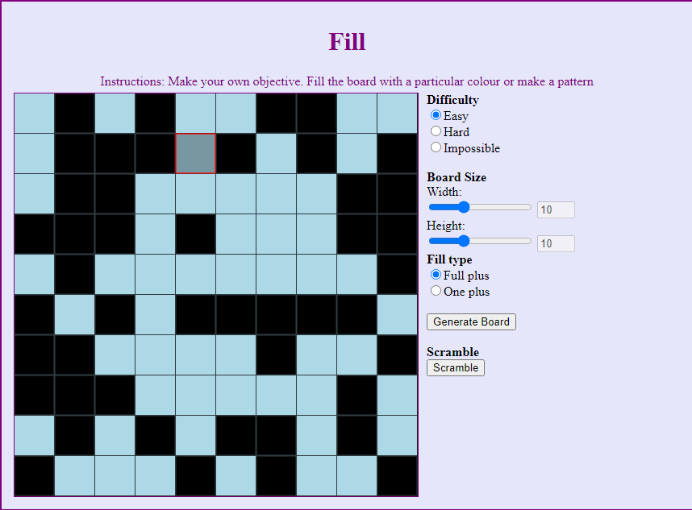
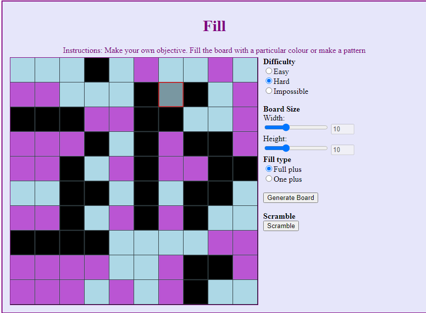
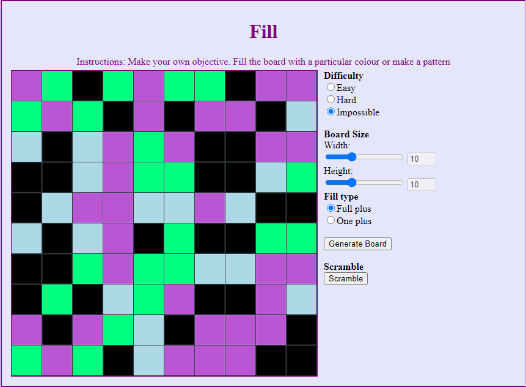
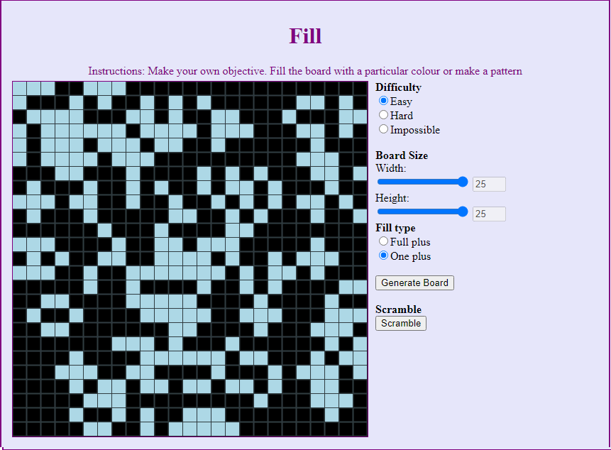

# Fill [](https://opensource.org/licenses/MIT)

## Description
Fill the board with one particular colour. There are different levels of difficulty ranging from Easy to impossible. The difficulties add more colours to the mix. The deployed app can be found here: https://seangenge.github.io/Fill/

## Table of Contents
- [Installation](#installation)
  
- [Usage](#usage)
  
- [License](#license)
  
- [Questions](#questions)

Fill easy mode



Fill hard mode



Fill impossible mode



Fill large board



## Installation
To install the necessary dependencies, run the following command:
```
  npm i
```

## License
This project is licensed under the [MIT](https://opensource.org/licenses/MIT) license

## Questions
If you have any questions about the repo, open an issue or contact me directly at seangenge@gmail.com. You can find more of my work at [seangenge](https://github.com/seangenge).
